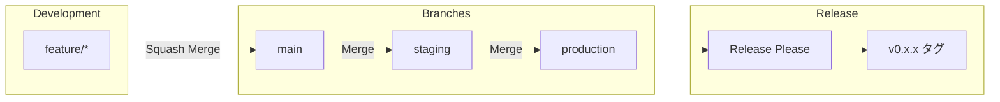

# WebSecScanner

[](https://github.com/masakaya/web-sec-scanner/actions/workflows/test.yml)
[](https://codecov.io/gh/masakaya/web-sec-scanner)
[](https://github.com/masakaya/web-sec-scanner/actions/workflows/ruff.yml)
[](https://github.com/masakaya/web-sec-scanner/actions/workflows/mypy.yml)
[](https://www.python.org/downloads/)

Modern Python Webセキュリティスキャナー - PrefectワークフローとWebGoatテスト環境を統合

> **📊 カバレッジレポート**: [Codecov](https://codecov.io/gh/masakaya/web-sec-scanner) で確認できます。各 PR にも自動的にカバレッジレポートがコメントされます。

## 📋 概要

WebSecScannerは、Webアプリケーションのセキュリティ脆弱性を検出するための最新のPythonベーススキャナーです。
Prefectによるワークフローオーケストレーションと、WebGoatによる実践的なテスト環境を統合しています。

---

## 🚀 クイックスタート

### 前提条件

- Python 3.12+
- [uv](https://github.com/astral-sh/uv) がインストール済み
- Docker & Docker Compose（WebGoatテスト環境用）

### セットアップ

```bash
# リポジトリをクローン
git clone https://github.com/masakaya/web-sec-scanner.git
cd web-sec-scanner

# 依存関係をインストール
uv sync --all-groups

# Git hooks をインストール（コミットメッセージ検証用）
# 注意: poeコマンドは直接使えません。uv run poe で実行してください
uv run poe setup-hooks

# WebGoatテスト環境を起動（オプション）
docker compose up -d

# 開発準備完了！
```

> **⚠️ 注意**: `poe`コマンドは直接使用できません。必ず `uv run poe <コマンド>` の形式で実行してください。

### WebGoatテスト環境（オプション）

セキュリティ診断レポート出力のサンプルとして、WebGoat環境を利用できます：

```bash
# WebGoat起動
docker compose up -d

# WebGoat停止
docker compose down
```

WebGoatは意図的に脆弱性を含んだWebアプリケーションで、セキュリティ診断ツールでスキャンしてレポートを生成するためのテスト対象として使用します。
詳細は [docs/WEBGOAT.md](docs/WEBGOAT.md) を参照してください。

### Juice Shopテスト環境（オプション）

JWT/Bearer認証のテストには、Juice Shop環境を利用できます：

```bash
# Juice Shop起動
docker compose up -d juice-shop

# Juice Shop停止
docker compose down juice-shop

# JWTトークン取得（ヘルパースクリプト）
./scripts/get-juice-shop-token.sh
```

Juice ShopはモダンなSPA（Single Page Application）として実装された脆弱性学習プラットフォームで、JWT/Bearer認証を使用したセキュリティスキャンのテスト対象として最適です。
詳細は [docs/JUICE_SHOP.md](docs/JUICE_SHOP.md) を参照してください。

### スキャンコマンド

本プロジェクトでは、セキュリティスキャンを実行するための便利なpoeタスクを提供しています。

#### 推奨: プリセットを使用した高速実行

最も簡単な方法は、プリセット設定を使用したpoeタスクです：

```bash
# 高速スキャン（1-3分、fast-scan.json使用）
uv run poe fast-scan -- <target_url> [認証オプション]

# 徹底的スキャン（10-30分、thorough-scan.json使用）
uv run poe thorough-scan -- <target_url> [認証オプション]
```

**プリセットのメリット**：
- Spider、Active Scan、Passive Scanの設定が最適化済み
- 認証設定はコマンドライン引数で柔軟に指定可能
- レポートディレクトリ名でスキャンタイプを識別しやすい（`fast-*`、`thorough-*`）

#### 汎用スキャナー

より細かい制御が必要な場合は、scanタスクを使用できます：

```bash
uv run poe scan -- <scan_type> <target_url> [オプション]
```

詳細な引数リファレンスは以下を参照してください。

### セキュリティスキャン コマンドライン引数リファレンス

#### スキャンタイプ

| タイプ | 説明 | 用途 |
|--------|------|------|
| `baseline` | 基本的な受動スキャン | 安全で高速な初期チェック |
| `full` | 完全スキャン（Spider + Active Scan） | 徹底的な脆弱性検査 |
| `api` | APIスキャン | REST API専用 |
| `automation` | Automation Framework | カスタム設定ファイルによる柔軟なスキャン |

**スキャンタイプと設定ファイルの関係**

| タイプ | `--config-file` | 制御方法 |
|--------|----------------|---------|
| `baseline` | **使用不可** | コマンドライン引数のみで制御 |
| `full` | **使用不可** | コマンドライン引数のみで制御 |
| `api` | **使用不可** | コマンドライン引数のみで制御 |
| `automation` | **使用可能** | 設定ファイル（fast-scan.json、thorough-scan.json）で詳細設定が可能。未指定時はデフォルト設定で動作 |

#### 認証オプション

| 引数 | 説明 | 例 |
|------|------|-----|
| `--auth-type` | 認証方式: `none`, `form`, `json`, `basic`, `bearer` | `--auth-type form` |
| `--username` | ユーザー名 | `--username admin` |
| `--password` | パスワード | `--password secret` |
| `--login-url` | ログインエンドポイントURL | `--login-url http://example.com/login` |
| `--username-field` | ユーザー名フィールド名 | `--username-field email` |
| `--password-field` | パスワードフィールド名 | `--password-field passwd` |
| `--logged-in-indicator` | ログイン成功を示す正規表現 | `--logged-in-indicator "Logout"` |
| `--logged-out-indicator` | ログアウト状態を示す正規表現 | `--logged-out-indicator "Login"` |
| `--session-method` | セッション管理方式: `cookie`, `http` | `--session-method cookie` |
| `--auth-token` | Bearer トークン（JWT、API キーなど） | `--auth-token $JWT_TOKEN` |
| `--auth-header` | トークン認証のヘッダー名 | `--auth-header Authorization` |
| `--token-prefix` | トークンプレフィックス（`none` で無し） | `--token-prefix Bearer` |

#### スキャンオプション

| 引数 | 説明 | デフォルト | 例 |
|------|------|-----------|-----|
| `--ajax-spider` | AJAX Spider を有効化（JavaScript多用サイト向け） | 無効 | `--ajax-spider` |
| `--max-duration` | 最大スキャン時間（分） | 30 | `--max-duration 60` |
| `--max-depth` | 最大クロール深度 | 10 | `--max-depth 15` |
| `--max-children` | ノードあたりの最大子要素数 | 20 | `--max-children 50` |
| `--thread-per-host` | ホストあたりのスレッド数 | 10 | `--thread-per-host 8` |
| `--hosts-per-scan` | 並列スキャンするホスト数 | 5 | `--hosts-per-scan 3` |
| `--network` | Docker ネットワーク名（未指定時は自動検出） | 自動検出 | `--network webgoat_default` |
| `--report-dir` | レポート保存ディレクトリ | `./report` | `--report-dir /tmp/reports` |
| `--language` | スキャナーとレポートの言語 | `ja_JP` | `--language en_US` |
| `--config-file` | スキャン設定プリセットファイル | なし | `--config-file resources/config/fast-scan.json` |
| `--addon` | ZAP AddOn（複数指定可能） | authhelper, ascanrules, bruteforce, spiderAjax, sqliplugin | `--addon jwt --addon graphql` |

#### スキャン設定プリセット

| ファイル | 説明 | スキャン時間（目安） |
|---------|------|---------------------|
| `resources/config/fast-scan.json` | 高速スキャン（開発・CI向け） | 1-3分 |
| `resources/config/thorough-scan.json` | 徹底的スキャン（本番前チェック） | 10-30分 |

#### 実行例

```bash
# 1. 高速スキャン（WebGoat、フォーム認証）
uv run poe fast-scan -- http://webgoat:8080/WebGoat/ \
  --username masakaya \
  --password Password \
  --auth-type form \
  --login-url http://webgoat:8080/WebGoat/login \
  --logged-in-indicator "Sign Out"

# 2. 徹底的スキャン（WebGoat、フォーム認証）
uv run poe thorough-scan -- http://webgoat:8080/WebGoat/ \
  --username masakaya \
  --password Password \
  --auth-type form \
  --login-url http://webgoat:8080/WebGoat/login \
  --logged-in-indicator "Sign Out"

# 3. 高速スキャン（Juice Shop、Bearer認証）
export JWT_TOKEN='your-jwt-token-here'
uv run poe fast-scan -- http://juice-shop:3000 \
  --auth-type bearer \
  --auth-token "$JWT_TOKEN"

# 4. 汎用スキャナー（APIスキャン、Bearer認証）
uv run poe scan -- api http://api.example.com \
  --auth-type bearer \
  --auth-token $JWT_TOKEN \
  --max-duration 10

# 5. 汎用スキャナー（ベースラインスキャン、認証なし）
uv run poe scan -- baseline http://example.com
```

#### レポート確認

スキャン完了後、レポートディレクトリに以下の形式でレポートが生成されます：

```bash
report/
├── fast-20251123_093000/          # fast-scan.json使用時
│   ├── scan-report.html
│   ├── scan-report.json
│   └── scan-report.xml
└── thorough-20251123_140000/      # thorough-scan.json使用時
    ├── scan-report.html
    ├── scan-report.json
    └── scan-report.xml
```

HTMLレポートをブラウザで確認：

```bash
# Linux
xdg-open report/fast-*/scan-report.html

# macOS
open report/fast-*/scan-report.html
```

### Bearer/JWT認証によるセキュリティスキャン

最新のSPA（Single Page Application）で広く使われるBearer/JWT認証に対応したセキュリティスキャンが可能です。

#### 準備

```bash
# Juice Shop起動（JWT認証のテスト環境）
docker compose up -d juice-shop

# JWTトークンを取得（ヘルパースクリプト使用）
./scripts/get-juice-shop-token.sh
```

#### スキャン実行例

```bash
# 1. 高速スキャン（fast-scan.json使用） - 約1-3分
export JWT_TOKEN='your-jwt-token-here'
uv run poe fast-scan -- http://juice-shop:3000 \
  --auth-type bearer \
  --auth-token "$JWT_TOKEN"

# 2. 徹底的スキャン（thorough-scan.json使用） - 約10-30分
uv run poe thorough-scan -- http://juice-shop:3000 \
  --auth-type bearer \
  --auth-token "$JWT_TOKEN"

# 3. 汎用スキャナー（APIスキャン） - 約5-10分
uv run poe scan -- api http://juice-shop:3000 \
  --auth-type bearer \
  --auth-token "$JWT_TOKEN" \
  --max-duration 10
```

詳細な使い方とトラブルシューティングは [docs/JUICE_SHOP.md](docs/JUICE_SHOP.md) を参照してください。

---

## 📝 コミットルール（必読）

**このプロジェクトは Conventional Commits を使用した自動バージョニングを採用しています。**

### 必須フォーマット

すべてのコミットメッセージは以下の形式に従う必要があります：

```
<type>: <description>

[optional body]

[optional footer]
```

### タイプと影響

| Type | 説明 | 例 | バージョン影響 |
|------|------|-----|---------------|
| `feat` | 新機能追加 | `feat: add user login` | 0.1.0 → **0.2.0** |
| `fix` | バグ修正 | `fix: resolve memory leak` | 0.1.0 → **0.1.1** |
| `feat!` | 破壊的変更 | `feat!: redesign API` | 0.1.0 → **1.0.0** |
| `chore` | メンテナンス | `chore: update dependencies` | なし |
| `docs` | ドキュメント | `docs: update README` | なし |
| `refactor` | リファクタリング | `refactor: simplify logic` | なし |
| `test` | テスト | `test: add unit tests` | なし |
| `ci` | CI/CD変更 | `ci: add workflow` | なし |

### 自動検証

**gitlint** がコミット時に自動的にメッセージを検証します：

```bash
# ✅ 成功 - 正しいフォーマット
git commit -m "feat: add authentication"
git commit -m "fix: resolve login bug"
git commit -m "docs: update setup guide"

# ❌ 失敗 - 不正なフォーマット
git commit -m "Added feature"        # Type がない
git commit -m "add: new feature"     # 無効な type
git commit -m "feat:add feature"     # コロン後のスペースがない
git commit -m "feat: a"              # description が短すぎる（最低10文字）
```

### 破壊的変更の書き方

```bash
# 方法1: ! を付ける
git commit -m "feat!: remove old API

BREAKING CHANGE: The legacy API has been removed"

# 方法2: BREAKING CHANGE フッター
git commit -m "refactor: change config format

BREAKING CHANGE: Configuration file format changed from JSON to YAML"
```

### なぜ重要か

- **自動バージョニング**: production へのマージ時、コミット履歴から自動的にバージョンを決定
- **CHANGELOG 生成**: コミットメッセージから自動的に CHANGELOG.md を生成
- **リリース管理**: 適切なバージョンで GitHub Release を作成

### トラブルシューティング

```bash
# フックが動作しない場合
poe setup-hooks

# 最後のコミットメッセージを検証
poe validate-commit

# フックを一時的に無効化（非推奨）
git commit --no-verify -m "message"
```

詳細: [Conventional Commits 公式サイト](https://www.conventionalcommits.org/)

---

## 📚 ドキュメント

### コード品質

| ツール | 用途 | ドキュメント |
|-------|------|-------------|
| **Ruff** | Linting & Formatting | [docs/RUFF.md](docs/RUFF.md) |
| **mypy** | 静的型チェック | [docs/MYPY.md](docs/MYPY.md) |
| **pytest** | テスティング | [docs/TESTING.md](docs/TESTING.md) |
| **Prefect** | ワークフローオーケストレーション | [docs/PREFECT.md](docs/PREFECT.md) |
| **WebGoat** | セキュリティテスト環境（フォーム認証） | [docs/WEBGOAT.md](docs/WEBGOAT.md) |
| **Juice Shop** | セキュリティテスト環境（JWT/Bearer認証） | [docs/JUICE_SHOP.md](docs/JUICE_SHOP.md) |
| **Renovate** | 依存関係自動更新 | [docs/RENOVATE.md](docs/RENOVATE.md) |

### タスク管理

**Poe the Poet** - プロジェクト全体で統一されたタスクコマンド

```bash
# 利用可能なタスク一覧
poe

# よく使うコマンド
poe lint              # Ruff linting
poe format            # コードフォーマット
poe typecheck         # 型チェック
poe test              # テスト実行
poe check             # 全チェック実行
poe prefect-server    # Prefectサーバー起動（IP自動検出、外部アクセス可能）
poe prefect-example   # Prefectサンプルフロー実行
```

---

## 🤖 GitHub Actions

このテンプレートには7つの自動化ワークフローが含まれています：

### コード品質ワークフロー

| ワークフロー | トリガー | 処理内容 |
|-------------|---------|---------|
| **Ruff** | push/PR | コード品質チェック、自動フォーマット＋コミット |
| **mypy** | push/PR | 型チェック、PRへのエラー指摘 |
| **Test** | push/PR | テスト実行、カバレッジレポート |
| **Renovate** | 毎週土曜 3:00 JST | 依存関係の更新PR作成 |

### ブランチプロモーションワークフロー

| ワークフロー | トリガー | 処理内容 |
|-------------|---------|---------|
| **Promote to Staging** | main へのpush | main → staging の自動PR作成（コンフリクト自動解決） |
| **Promote to Production** | staging へのpush | staging → production の自動PR作成（コンフリクト自動解決） |
| **Release** | production へのpush | リリースPR作成、GitHub Release、タグ作成（v0.x.x形式） |

---

## 💻 開発ワークフロー

### ブランチ戦略



### マージ種別

| ブランチ間 | マージ方法 | 理由 |
|-----------|-----------|------|
| feature → main | **Squash Merge** | 細かいコミットをまとめて履歴をクリーンに |
| main → staging | **Merge** | 機能単位の履歴を保持（Revert可能） |
| staging → production | **Merge** | 機能単位の履歴を保持（Revert可能） |

### 日常的な開発

```bash
# 1. feature ブランチを作成
git checkout -b feat/new-feature main

# 2. コード編集 & コミット
poe check  # lint + format + typecheck + test
git add .
git commit -m "feat: 新機能追加"

# 3. main へ PR 作成 & マージ
git push -u origin feat/new-feature
gh pr create --base main
```

### マージ後の自動フロー

1. **main へマージ** → 自動で `main → staging` のPRが作成される
2. **staging PRをマージ** → 自動で `staging → production` のPRが作成される
3. **production PRをマージ** → Release Please がリリースPRを作成
4. **リリースPRをマージ** → タグ（v0.x.x）とGitHub Releaseが自動作成

**注意**: コミットメッセージは [📝 コミットルール](#-コミットルール必読) に従う必要があります。

---

## 📦 プロジェクト構成

```
.
├── .github/
│   ├── scripts/          # ワークフロー用スクリプト
│   │   ├── ruff-review.sh
│   │   └── mypy-review.sh
│   ├── workflows/        # GitHub Actions
│   │   ├── ruff.yml
│   │   ├── mypy.yml
│   │   ├── test.yml
│   │   ├── promote-to-staging.yml
│   │   ├── promote-to-production.yml
│   │   └── release.yml
│   ├── release-please-config.json
│   └── .release-please-manifest.json
├── docs/                 # ドキュメント
│   ├── RUFF_INTEGRATION.md
│   ├── MYPY.md
│   └── TESTING.md
├── tests/                # テストファイル
├── pyproject.toml        # プロジェクト設定
├── ruff.toml            # Ruff設定
├── uv.lock              # 依存関係ロック
└── README.md            # このファイル
```

---

## 🔧 カスタマイズ

### プロジェクト情報の更新

`pyproject.toml` を編集：

```toml
[project]
name = "your-project-name"
version = "0.1.0"
description = "Your project description"
requires-python = ">=3.12"
```

### Ruffルールの調整

`ruff.toml` を編集してルールをカスタマイズ

### mypy設定の変更

`pyproject.toml` の `[tool.mypy]` セクションで調整

---

## 📝 タスクコマンド一覧

```bash
# Linting
poe lint              # チェックのみ
poe lint-fix          # 自動修正
poe lint-unsafe       # 安全でない修正も実行

# フォーマット
poe format            # フォーマット実行
poe format-check      # チェックのみ

# 型チェック
poe typecheck         # 全体チェック
poe typecheck <file>  # 特定ファイル
poe typecheck-strict  # 厳格モード
poe typecheck-review  # reviewdogで確認

# テスト
poe test              # テスト実行
poe test-cov          # カバレッジ付き
poe test-verbose      # 詳細出力

# Prefect
poe prefect-server    # Prefectサーバー起動（IP自動検出、外部アクセス可能）
poe prefect-example   # サンプルフロー実行
poe prefect-deploy    # フローデプロイ

# WebGoat
poe webgoat-start     # WebGoat起動
poe webgoat-stop      # WebGoat停止
poe webgoat-logs      # WebGoatログ表示
poe webgoat-restart   # WebGoat再起動

# reviewdog（ローカル）
poe review-local      # Ruff reviewdog
poe typecheck-review  # mypy reviewdog

# 統合
poe check             # 全チェック
poe fix               # 自動修正可能なもの全て
poe ci                # CI用チェック

# その他
poe clean             # キャッシュ削除
poe install           # 依存関係インストール
poe update            # 依存関係更新
```

---

## 🤝 コントリビューション

このテンプレートの改善提案は Issue または Pull Request でお願いします。

---

## 📄 ライセンス

このテンプレートは自由に使用・改変できます。