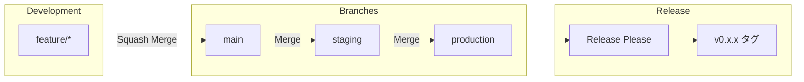

# WebSecScanner

[](https://github.com/masakaya/web-sec-scanner/actions/workflows/test.yml)
[](https://codecov.io/gh/masakaya/web-sec-scanner)
[](https://github.com/masakaya/web-sec-scanner/actions/workflows/ruff.yml)
[](https://github.com/masakaya/web-sec-scanner/actions/workflows/mypy.yml)
[](https://www.python.org/downloads/)

Modern Python Webセキュリティスキャナー - PrefectワークフローとWebGoatテスト環境を統合

> **📊 カバレッジレポート**: [Codecov](https://codecov.io/gh/masakaya/web-sec-scanner) で確認できます。各 PR にも自動的にカバレッジレポートがコメントされます。

## 📋 概要

WebSecScannerは、Webアプリケーションのセキュリティ脆弱性を検出するための最新のPythonベーススキャナーです。
Prefectによるワークフローオーケストレーションと、WebGoatによる実践的なテスト環境を統合しています。

### 主な特徴

- ✅ **高速パッケージ管理**: [uv](https://github.com/astral-sh/uv) による爆速の依存関係管理
- ✅ **自動コード品質チェック**: Ruff による linting とフォーマット
- ✅ **静的型チェック**: mypy による型安全性の保証
- ✅ **自動テスト**: pytest + カバレッジレポート
- ✅ **タスクランナー**: Poe the Poet による統一されたコマンド
- ✅ **ワークフローオーケストレーション**: Prefect によるタスク管理と監視
- ✅ **テスト環境**: WebGoat によるセキュリティテスト環境
- ✅ **コミットメッセージ強制**: gitlint による Conventional Commits 検証
- ✅ **自動バージョニング**: release-please による自動リリース管理
- ✅ **ブランチ自動プロモーション**: main → staging → production の自動PR作成
- ✅ **コンフリクト自動解決**: プロモーション時のコンフリクトを自動解決
- ✅ **GitHub Actions 統合**: reviewdog による自動コードレビュー
- ✅ **自動フォーマット**: PR時に自動的にコード整形＋コミット
- ✅ **依存関係自動更新**: Renovate による定期的な依存関係更新

---

## 🚀 クイックスタート

### 前提条件

- Python 3.12+
- [uv](https://github.com/astral-sh/uv) がインストール済み
- Docker & Docker Compose（WebGoatテスト環境用）

### セットアップ

```bash
# リポジトリをクローン
git clone https://github.com/masakaya/web-sec-scanner.git
cd web-sec-scanner

# 依存関係をインストール
uv sync --all-groups

# Git hooks をインストール（コミットメッセージ検証用）
# 注意: poeコマンドは直接使えません。uv run poe で実行してください
uv run poe setup-hooks

# WebGoatテスト環境を起動（オプション）
uv run poe webgoat-start

# 開発準備完了！
```

> **⚠️ 注意**: `poe`コマンドは直接使用できません。必ず `uv run poe <コマンド>` の形式で実行してください。

### WebGoatテスト環境（オプション）

セキュリティ診断レポート出力のサンプルとして、WebGoat環境を利用できます：

```bash
# WebGoat起動
uv run poe webgoat-start

# WebGoat停止
uv run poe webgoat-stop
```

WebGoatは意図的に脆弱性を含んだWebアプリケーションで、セキュリティ診断ツールでスキャンしてレポートを生成するためのテスト対象として使用します。
詳細は [docs/WEBGOAT.md](docs/WEBGOAT.md) を参照してください。

### Bearer/JWT認証によるセキュリティスキャン

最新のSPA（Single Page Application）で広く使われるBearer/JWT認証に対応したセキュリティスキャンが可能です。

#### 準備

```bash
# Juice Shop起動（JWT認証のテスト環境）
docker compose up -d juice-shop

# JWTトークンを取得（ヘルパースクリプト使用）
./scripts/get-juice-shop-token.sh
```

#### スキャン実行例

```bash
# 1. 高速スキャン（Automation Framework）- 約3分
export JWT_TOKEN='your-jwt-token-here'
PYTHONPATH=src uv run python -m scanner.main automation http://juice-shop:3000 \
  --auth-type bearer \
  --auth-token "$JWT_TOKEN" \
  --network web-sec-scanner_default \
  --config-file resources/config/fast-scan.json \
  --max-duration 3

# 2. フルスキャン - 約10-15分（※Bearer認証は現在automation/apiスキャンのみ対応）
# PYTHONPATH=src uv run python -m scanner.main full http://juice-shop:3000 \
#   --auth-type bearer \
#   --auth-token "$JWT_TOKEN" \
#   --network web-sec-scanner_default \
#   --ajax-spider \
#   --max-duration 10

# 3. APIスキャン - 約5-10分
PYTHONPATH=src uv run python -m scanner.main api http://juice-shop:3000 \
  --auth-type bearer \
  --auth-token "$JWT_TOKEN" \
  --network web-sec-scanner_default \
  --max-duration 10
```

#### スキャン結果の確認

スキャン完了後、`report/` ディレクトリにレポートが生成されます：

```bash
# レポート一覧
ls -lh report/

# HTMLレポートをブラウザで開く
xdg-open report/<scan-directory>/scan-report.html  # Linux
open report/<scan-directory>/scan-report.html      # macOS
```

#### 対応する認証方式

| 認証方式 | パラメータ | 用途 |
|---------|-----------|------|
| **Bearer** | `--auth-type bearer --auth-token <token>` | JWT/API Token認証（SPA、REST API） |
| **Form** | `--auth-type form --username <user> --password <pass>` | フォームベース認証 |
| **JSON** | `--auth-type json --username <user> --password <pass>` | JSON APIログイン |
| **Basic** | `--auth-type basic --username <user> --password <pass>` | Basic認証 |

詳細な使い方とトラブルシューティングは [docs/JUICE_SHOP.md](docs/JUICE_SHOP.md) を参照してください。

---

## 📝 コミットルール（必読）

**このプロジェクトは Conventional Commits を使用した自動バージョニングを採用しています。**

### 必須フォーマット

すべてのコミットメッセージは以下の形式に従う必要があります：

```
<type>: <description>

[optional body]

[optional footer]
```

### タイプと影響

| Type | 説明 | 例 | バージョン影響 |
|------|------|-----|---------------|
| `feat` | 新機能追加 | `feat: add user login` | 0.1.0 → **0.2.0** |
| `fix` | バグ修正 | `fix: resolve memory leak` | 0.1.0 → **0.1.1** |
| `feat!` | 破壊的変更 | `feat!: redesign API` | 0.1.0 → **1.0.0** |
| `chore` | メンテナンス | `chore: update dependencies` | なし |
| `docs` | ドキュメント | `docs: update README` | なし |
| `refactor` | リファクタリング | `refactor: simplify logic` | なし |
| `test` | テスト | `test: add unit tests` | なし |
| `ci` | CI/CD変更 | `ci: add workflow` | なし |

### 自動検証

**gitlint** がコミット時に自動的にメッセージを検証します：

```bash
# ✅ 成功 - 正しいフォーマット
git commit -m "feat: add authentication"
git commit -m "fix: resolve login bug"
git commit -m "docs: update setup guide"

# ❌ 失敗 - 不正なフォーマット
git commit -m "Added feature"        # Type がない
git commit -m "add: new feature"     # 無効な type
git commit -m "feat:add feature"     # コロン後のスペースがない
git commit -m "feat: a"              # description が短すぎる（最低10文字）
```

### 破壊的変更の書き方

```bash
# 方法1: ! を付ける
git commit -m "feat!: remove old API

BREAKING CHANGE: The legacy API has been removed"

# 方法2: BREAKING CHANGE フッター
git commit -m "refactor: change config format

BREAKING CHANGE: Configuration file format changed from JSON to YAML"
```

### なぜ重要か

- **自動バージョニング**: production へのマージ時、コミット履歴から自動的にバージョンを決定
- **CHANGELOG 生成**: コミットメッセージから自動的に CHANGELOG.md を生成
- **リリース管理**: 適切なバージョンで GitHub Release を作成

### トラブルシューティング

```bash
# フックが動作しない場合
poe setup-hooks

# 最後のコミットメッセージを検証
poe validate-commit

# フックを一時的に無効化（非推奨）
git commit --no-verify -m "message"
```

詳細: [Conventional Commits 公式サイト](https://www.conventionalcommits.org/)

---

## 🛠️ 利用可能なツール

### コード品質

| ツール | 用途 | ドキュメント |
|-------|------|-------------|
| **Ruff** | Linting & Formatting | [docs/RUFF.md](docs/RUFF.md) |
| **mypy** | 静的型チェック | [docs/MYPY.md](docs/MYPY.md) |
| **pytest** | テスティング | [docs/TESTING.md](docs/TESTING.md) |
| **Prefect** | ワークフローオーケストレーション | [docs/PREFECT.md](docs/PREFECT.md) |
| **WebGoat** | セキュリティテスト環境 | [docs/WEBGOAT.md](docs/WEBGOAT.md) |
| **Renovate** | 依存関係自動更新 | [docs/RENOVATE.md](docs/RENOVATE.md) |

### タスク管理

**Poe the Poet** - プロジェクト全体で統一されたタスクコマンド

```bash
# 利用可能なタスク一覧
poe

# よく使うコマンド
poe lint           # Ruff linting
poe format         # コードフォーマット
poe typecheck      # 型チェック
poe test           # テスト実行
poe check          # 全チェック実行
poe prefect-server # Prefectサーバー起動（IP自動検出、外部アクセス可能）
poe prefect-example   # Prefectサンプルフロー実行
poe webgoat-start  # WebGoat起動
poe webgoat-stop   # WebGoat停止
```

---

## 📚 ドキュメント

各ツールの詳細な使い方とベストプラクティスは、以下のドキュメントを参照してください：

### Ruff（コード品質）
**[docs/RUFF.md](docs/RUFF.md)**
- Ruffの基本的な使い方
- IDE統合（VSCode、PyCharmなど）
- コマンドライン実行
- GitHub Actions 自動フォーマット
- reviewdog 連携

### mypy（型チェック）
**[docs/MYPY.md](docs/MYPY.md)**
- mypyの概要とメリット
- 型チェックの実行方法
- 型アノテーションの書き方
- 段階的な型導入
- よくあるエラーと対処法
- GitHub Actions 統合

### pytest（テスト）
**[docs/TESTING.md](docs/TESTING.md)**
- テストの書き方
- テスト実行方法
- カバレッジレポート
- マーカーの使い方
- ベストプラクティス

### Prefect（ワークフローオーケストレーション）
**[docs/PREFECT.md](docs/PREFECT.md)**
- Prefectの基本的な使い方
- フローとタスクの定義
- スケジュール実行
- ダッシュボードの使い方
- ベストプラクティス

### WebGoat（セキュリティテスト環境）
**[docs/WEBGOAT.md](docs/WEBGOAT.md)**
- WebGoatの基本的な使い方
- テスト環境の起動・停止
- セキュリティ診断ツールとの連携
- レポート出力のテスト方法
- セキュリティ上の注意事項

---

## 🤖 GitHub Actions

このテンプレートには7つの自動化ワークフローが含まれています：

### コード品質ワークフロー

| ワークフロー | トリガー | 処理内容 |
|-------------|---------|---------|
| **Ruff** | push/PR | コード品質チェック、自動フォーマット＋コミット |
| **mypy** | push/PR | 型チェック、PRへのエラー指摘 |
| **Test** | push/PR | テスト実行、カバレッジレポート |
| **Renovate** | 毎週土曜 3:00 JST | 依存関係の更新PR作成 |

### ブランチプロモーションワークフロー

| ワークフロー | トリガー | 処理内容 |
|-------------|---------|---------|
| **Promote to Staging** | main へのpush | main → staging の自動PR作成（コンフリクト自動解決） |
| **Promote to Production** | staging へのpush | staging → production の自動PR作成（コンフリクト自動解決） |
| **Release** | production へのpush | リリースPR作成、GitHub Release、タグ作成（v0.x.x形式） |

---

## 💻 開発ワークフロー

### ブランチ戦略



### マージ種別

| ブランチ間 | マージ方法 | 理由 |
|-----------|-----------|------|
| feature → main | **Squash Merge** | 細かいコミットをまとめて履歴をクリーンに |
| main → staging | **Merge** | 機能単位の履歴を保持（Revert可能） |
| staging → production | **Merge** | 機能単位の履歴を保持（Revert可能） |

### 日常的な開発

```bash
# 1. feature ブランチを作成
git checkout -b feat/new-feature main

# 2. コード編集 & コミット
poe check  # lint + format + typecheck + test
git add .
git commit -m "feat: 新機能追加"

# 3. main へ PR 作成 & マージ
git push -u origin feat/new-feature
gh pr create --base main
```

### マージ後の自動フロー

1. **main へマージ** → 自動で `main → staging` のPRが作成される
2. **staging PRをマージ** → 自動で `staging → production` のPRが作成される
3. **production PRをマージ** → Release Please がリリースPRを作成
4. **リリースPRをマージ** → タグ（v0.x.x）とGitHub Releaseが自動作成

**注意**: コミットメッセージは [📝 コミットルール](#-コミットルール必読) に従う必要があります。

---

## 📦 プロジェクト構成

```
.
├── .github/
│   ├── scripts/          # ワークフロー用スクリプト
│   │   ├── ruff-review.sh
│   │   └── mypy-review.sh
│   ├── workflows/        # GitHub Actions
│   │   ├── ruff.yml
│   │   ├── mypy.yml
│   │   ├── test.yml
│   │   ├── promote-to-staging.yml
│   │   ├── promote-to-production.yml
│   │   └── release.yml
│   ├── release-please-config.json
│   └── .release-please-manifest.json
├── docs/                 # ドキュメント
│   ├── RUFF_INTEGRATION.md
│   ├── MYPY.md
│   └── TESTING.md
├── tests/                # テストファイル
├── pyproject.toml        # プロジェクト設定
├── ruff.toml            # Ruff設定
├── uv.lock              # 依存関係ロック
└── README.md            # このファイル
```

---

## 🔧 カスタマイズ

### プロジェクト情報の更新

`pyproject.toml` を編集：

```toml
[project]
name = "your-project-name"
version = "0.1.0"
description = "Your project description"
requires-python = ">=3.12"
```

### Ruffルールの調整

`ruff.toml` を編集してルールをカスタマイズ

### mypy設定の変更

`pyproject.toml` の `[tool.mypy]` セクションで調整

---

## 📝 タスクコマンド一覧

```bash
# Linting
poe lint              # チェックのみ
poe lint-fix          # 自動修正
poe lint-unsafe       # 安全でない修正も実行

# フォーマット
poe format            # フォーマット実行
poe format-check      # チェックのみ

# 型チェック
poe typecheck         # 全体チェック
poe typecheck <file>  # 特定ファイル
poe typecheck-strict  # 厳格モード
poe typecheck-review  # reviewdogで確認

# テスト
poe test              # テスト実行
poe test-cov          # カバレッジ付き
poe test-verbose      # 詳細出力

# Prefect
poe prefect-server    # Prefectサーバー起動（IP自動検出、外部アクセス可能）
poe prefect-example   # サンプルフロー実行
poe prefect-deploy    # フローデプロイ

# WebGoat
poe webgoat-start     # WebGoat起動
poe webgoat-stop      # WebGoat停止
poe webgoat-logs      # WebGoatログ表示
poe webgoat-restart   # WebGoat再起動

# reviewdog（ローカル）
poe review-local      # Ruff reviewdog
poe typecheck-review  # mypy reviewdog

# 統合
poe check             # 全チェック
poe fix               # 自動修正可能なもの全て
poe ci                # CI用チェック

# その他
poe clean             # キャッシュ削除
poe install           # 依存関係インストール
poe update            # 依存関係更新
```

---

## 🤝 コントリビューション

このテンプレートの改善提案は Issue または Pull Request でお願いします。

---

## 📄 ライセンス

このテンプレートは自由に使用・改変できます。